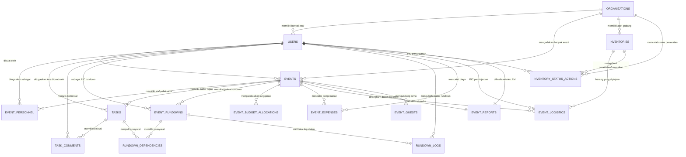

# Dokumentasi Fungsi dan Struktur Tabel Database - EventConnect

Dokumen ini berisi penjelasan lengkap mengenai fungsi, relasi, dan kamus data dari masing-masing tabel yang ada di dalam database platform **EventConnect**. 

Database ini dirancang dengan pendekatan **Single-Table Multi-Tenancy** menggunakan kolom `organization_id` pada entitas utama untuk mengisolasi data antar organisasi penyewa (tenant).

---

## 1. Pengelompokan Tabel Berdasarkan Modul

Untuk mempermudah pemahaman, tabel-tabel di EventConnect dikelompokkan ke dalam beberapa modul utama:

1. **Modul SaaS & Multi-Tenancy**: `organizations`, `users`, `personal_access_tokens`
2. **Modul Manajemen Event & Kolaborasi**: `events`, `event_personnel`, `chat_messages`
3. **Modul Manajemen Tugas (Kanban)**: `tasks`, `task_comments`
4. **Modul Rundown Acara (Real-Time)**: `event_rundowns`, `rundown_dependencies`, `rundown_logs`
5. **Modul Logistik & Inventaris**: `inventories`, `event_logistics`, `inventory_status_actions`
6. **Modul Anggaran & Keuangan**: `event_budget_allocations`, `event_expenses`
7. **Modul Tamu Undangan & Laporan**: `event_guests`, `event_reports`
8. **Modul Landing Page & Backoffice Admin**: `platform_admins`, `landing_contents`, `contact_messages`, `faqs`
9. **Sistem & Framework (Laravel Default)**: `cache`, `cache_locks`, `jobs`, `job_batches`, `failed_jobs`, `sessions`, `password_reset_tokens`

---

## 2. Hubungan Antar Tabel (Entity Relationship Diagram)

Berikut adalah diagram hubungan entitas (ERD) yang menggambarkan bagaimana tabel-tabel utama saling terhubung:

---

## 3. Penjelasan Fungsi Masing-Masing Tabel

### 3.1. Modul SaaS & Multi-Tenancy

#### 1. `organizations`
* **Fungsi**: Menyimpan data penyewa (tenant) atau Event Organizer (EO) yang mendaftar di platform.
* **Kolom Kunci**:
  * `id` (Primary Key)
  * `slug` (Unique, pengenal URL organisasi)
  * `status` (Status keaktifan: `pending`, `active`, `suspended`, `inactive`)
  * `plan` (Paket layanan: `free`, `business`, `enterprise`)
  * `max_users` & `max_events` (Batasan kuota berdasarkan paket)

#### 2. `users`
* **Fungsi**: Menyimpan data kredensial, informasi kontak, dan peran global dari pengguna (staf) di bawah naungan organisasi tertentu.
* **Kolom Kunci**:
  * `id` (Primary Key)
  * `organization_id` (Foreign Key ke `organizations.id`)
  * `role` (Peran organisasi: `superadmin`, `project_manager`, `staff`)
  * `status` (Keaktifan user: `active`, `inactive`)

#### 3. `personal_access_tokens`
* **Fungsi**: Menyimpan token autentikasi berbasis Sanctum untuk mengamankan API request dari sisi Frontend ke Backend.
* **Kolom Kunci**:
  * `tokenable_id` & `tokenable_type` (Polimorfik ke model `User` atau `PlatformAdmin`)

---

### 3.2. Modul Manajemen Event & Kolaborasi

#### 4. `events`
* **Fungsi**: Menyimpan informasi dasar mengenai acara/event yang direncanakan oleh organisasi.
* **Kolom Kunci**:
  * `id` (Primary Key)
  * `organization_id` (Foreign Key ke `organizations.id`)
  * `status` (Tahapan event: `draft`, `active`, `ongoing`, `completed`, `cancelled`)
  * `created_by` (Foreign Key ke `users.id` sebagai pembuat event)

#### 5. `event_personnel` (Tabel Pivot)
* **Fungsi**: Menghubungkan pengguna (staf) dengan event tertentu di mana mereka ditugaskan sebagai panitia pelaksana pelaksana lapangan.
* **Kolom Kunci**:
  * `event_id` (Foreign Key ke `events.id`)
  * `user_id` (Foreign Key ke `users.id`)
  * `role_in_event` (Peran spesifik dalam acara, e.g., 'Stage Manager', 'Logistics Coordinator')

#### 6. `chat_messages`
* **Fungsi**: Menyimpan log percakapan grup obrolan (chat) instan antar panitia yang ditugaskan pada event yang sama.
* **Kolom Kunci**:
  * `id` (Primary Key)
  * `event_id` (Foreign Key ke `events.id`)
  * `user_id` (Foreign Key ke `users.id` sebagai pengirim pesan)
  * `file_path`, `file_name`, `file_size` (Penyimpanan lampiran media/berkas chat)

---

### 3.3. Modul Manajemen Tugas (Kanban Board)

#### 7. `tasks`
* **Fungsi**: Menyimpan rincian tugas pengerjaan persiapan event (Kanban task) beserta tenggat waktu dan statusnya.
* **Kolom Kunci**:
  * `id` (Primary Key)
  * `event_id` (Foreign Key ke `events.id`)
  * `assigned_to` (Foreign Key ke `users.id` sebagai penerima tugas)
  * `parent_task_id` (Self-relation ke `tasks.id` untuk mendukung sub-task bertingkat)
  * `status` (`pending`, `in_progress`, `review`, `completed`, `cancelled`)
  * `priority` (`low`, `medium`, `high`, `urgent`)

#### 8. `task_comments`
* **Fungsi**: Menyimpan komentar dan tanggapan diskusi tim di bawah lembar detail tugas pengerjaan tertentu.
* **Kolom Kunci**:
  * `id` (Primary Key)
  * `task_id` (Foreign Key ke `tasks.id`)
  * `user_id` (Foreign Key ke `users.id`)

---

### 3.4. Modul Rundown Acara (Real-Time Timeline)

#### 9. `event_rundowns`
* **Fungsi**: Menyimpan detail jadwal susunan acara (timeline rundown) per kategori (seperti technical atau talent) dengan pelacakan waktu riil.
* **Kolom Kunci**:
  * `id` (Primary Key)
  * `event_id` (Foreign Key ke `events.id`)
  * `pic_id` (Foreign Key ke `users.id` sebagai penanggung jawab aktivitas rundown)
  * `status` (Status pelaksanaan: `pending`, `ready`, `live`, `delayed`, `completed`)
  * `delay_minutes` (Mencatat total durasi keterlambatan acara dalam satuan menit)

#### 10. `rundown_dependencies`
* **Fungsi**: Mengaitkan item rundown dengan tugas (`tasks`) tertentu sebagai prasyarat keberlangsungan rundown (contoh: Rundown 'Sound Check' tidak bisa dimulai jika tugas 'Sewa Sound System' belum rampung).
* **Kolom Kunci**:
  * `rundown_id` (Foreign Key ke `event_rundowns.id`)
  * `task_id` (Foreign Key ke `tasks.id`)

#### 11. `rundown_logs`
* **Fungsi**: Menyimpan jejak audit (*audit trail*) riwayat perubahan status rundown, siapa yang merubahnya, dan alasan penundaan jika status bergeser ke `delayed`.
* **Kolom Kunci**:
  * `rundown_id` (Foreign Key ke `event_rundowns.id`)
  * `user_id` (Foreign Key ke `users.id` yang melakukan perubahan status)

---

### 3.5. Modul Logistik & Inventaris

#### 12. `inventories`
* **Fungsi**: Menyimpan katalog aset barang yang berada di gudang pusat organisasi, serta mencatat kepemilikan dan harga sewa.
* **Kolom Kunci**:
  * `id` (Primary Key)
  * `organization_id` (Foreign Key ke `organizations.id`)
  * `ownership` (Status kepemilikan: `owned` [milik sendiri], `rented` [sewa dari vendor])
  * `status` (Kondisi barang: `ready`, `maintenance`, `damaged`)
  * `total_quantity` & `available_quantity` (Stok total vs stok siap pakai)

#### 13. `event_logistics`
* **Fungsi**: Menyimpan riwayat peminjaman (*checkout*) barang dari gudang pusat ke event tertentu, serta merekam status pengembalian (*check-in*).
* **Kolom Kunci**:
  * `id` (Primary Key)
  * `event_id` (Foreign Key ke `events.id`)
  * `inventory_id` (Foreign Key ke `inventories.id`)
  * `user_id` (Foreign Key ke `users.id` sebagai penanggung jawab lapangan / PIC)
  * `rent_cost` (Biaya sewa otomatis jika barang berstatus `rented`)
  * `return_status` (Kondisi barang saat kembali: `complete`, `incomplete`, `damaged`)

#### 14. `inventory_status_actions`
* **Fungsi**: Mencatat dan memantau status pemeliharaan/perbaikan (*maintenance*) atau laporan kerusakan (*damaged*) dari stok barang gudang agar dapat ditelusuri riwayat perbaikannya.
* **Kolom Kunci**:
  * `id` (Primary Key)
  * `organization_id` (Foreign Key ke `organizations.id`)
  * `inventory_id` (Foreign Key ke `inventories.id`)
  * `user_id` (Foreign Key ke `users.id` sebagai PIC pelapor/teknisi)
  * `type` (Jenis tindakan: `maintenance`, `damaged`)
  * `status` (Status penanganan: `active`, `resolved`)

---

### 3.6. Modul Anggaran & Keuangan

#### 15. `event_budget_allocations`
* **Fungsi**: Mengalokasikan batasan anggaran rencana awal per kategori pengeluaran (contoh: Konsumsi, Dekorasi, Talent) dalam suatu event.
* **Kolom Kunci**:
  * `id` (Primary Key)
  * `event_id` (Foreign Key ke `events.id`)
  * `category` (Kategori anggaran)
  * `allocated_amount` (Nominal alokasi dana rencana)

#### 16. `event_expenses`
* **Fungsi**: Mencatat pengeluaran riil/aktual yang dikeluarkan selama persiapan dan pelaksanaan event untuk memantau sisa anggaran secara real-time.
* **Kolom Kunci**:
  * `id` (Primary Key)
  * `event_id` (Foreign Key ke `events.id`)
  * `user_id` (Foreign Key ke `users.id` yang mencatatkan pengeluaran)
  * `amount` (Nominal pengeluaran aktual)
  * `category` (Disinkronkan dengan kategori anggaran untuk perbandingan)

---

### 3.7. Modul Tamu Undangan & Laporan Akhir

#### 17. `event_guests`
* **Fungsi**: Menyimpan daftar tamu undangan per event, merekam konfirmasi kehadiran (RSVP), serta status check-in kehadiran di lokasi acara.
* **Kolom Kunci**:
  * `id` (Primary Key)
  * `event_id` (Foreign Key ke `events.id`)
  * `category` (Kelas undangan: `vvip`, `vip`, `regular`)
  * `rsvp_status` (`pending`, `attending`, `declined`)
  * `checkin_status` & `checked_in_at` (Untuk pencatatan kehadiran presensi di hari H)

#### 18. `event_reports`
* **Fungsi**: Menyimpan hasil laporan evaluasi akhir, rekomendasi pasca-event, serta salinan snapshot data keuangan/logistik/tugas saat event ditandai selesai (finalized).
* **Kolom Kunci**:
  * `id` (Primary Key)
  * `event_id` (Foreign Key ke `events.id` - Relasi One-to-One)
  * `user_id` (Foreign Key ke `users.id` sebagai Project Manager yang memfinalisasi)
  * `budget_snapshot`, `task_snapshot`, `logistic_snapshot` (Format JSON menyimpan keadaan data terakhir)

---

### 3.8. Modul Landing Page & Platform Admin (Backoffice)

#### 19. `platform_admins`
* **Fungsi**: Menyimpan kredensial login administrator sistem/platform pusat untuk mengelola data master SaaS.
* **Kolom Kunci**:
  * `id` (Primary Key)
  * `role` (Peran administrator: `owner`, `admin`, `support`)
  * `status` (`active`, `inactive`)

#### 20. `landing_contents`
* **Fungsi**: Menyimpan konten teks publik pada landing page pemasaran (seperti Judul Hero, Subjudul, deskripsi fitur) yang dapat diubah secara dinamis oleh admin platform.
* **Kolom Kunci**:
  * `key_name` (Unique, pengenal lokasi konten di frontend, e.g., 'hero_title')

#### 21. `contact_messages`
* **Fungsi**: Menampung kiriman formulir pesan pengujung ("Hubungi Kami") dari landing page publik untuk diproses admin platform.
* **Kolom Kunci**:
  * `id` (Primary Key)
  * `name`, `email`, `subject`, `message`

#### 22. `faqs`
* **Fungsi**: Menyimpan daftar pertanyaan umum (Frequently Asked Questions) beserta jawabannya untuk ditampilkan di landing page.
* **Kolom Kunci**:
  * `id` (Primary Key)
  * `order_number` (Menentukan urutan tampilan akordeon FAQ)

---

### 3.9. Sistem & Framework (Laravel Default)

#### 23. `cache` & `cache_locks`
* **Fungsi**: Digunakan oleh framework Laravel untuk menyimpan data cache aplikasi dan mengunci transaksi konkuren agar performa lebih cepat.

#### 24. `jobs`, `job_batches`, & `failed_jobs`
* **Fungsi**: Mengelola antrean pekerjaan asynchronous (queue jobs) seperti pengiriman email notifikasi massal, pemrosesan laporan besar di latar belakang, dan pencatatan jika ada tugas antrean yang gagal.

#### 25. `sessions`
* **Fungsi**: Menyimpan status sesi pengguna jika aplikasi diakses menggunakan stateful session cookies (terutama saat testing/pengembangan lokal).

#### 26. `password_reset_tokens`
* **Fungsi**: Menyimpan token verifikasi sementara yang digunakan ketika pengguna meminta reset kata sandi melalui email.
